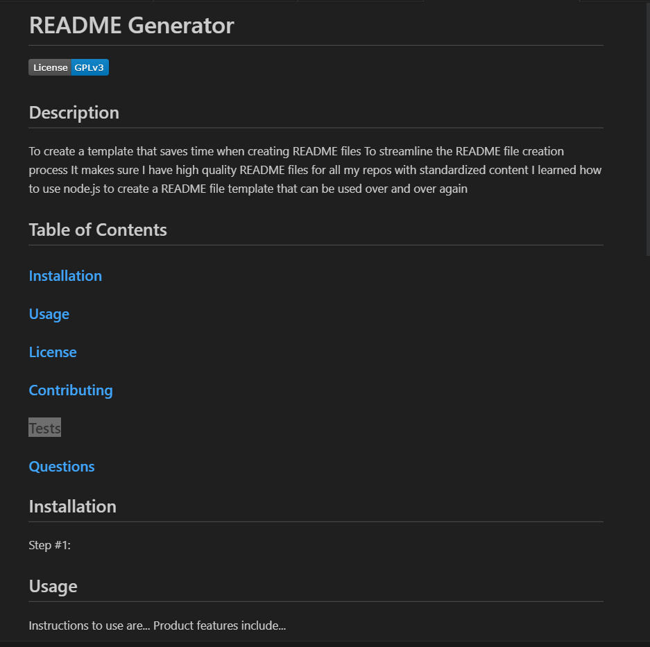

# Node.js - README Generator Homework Assignment

## What I attempted to do:

Create an application that makes a README.md file based on user input. The application is run by entering the comman "node index.js" into the terminal.

## Screen shot from one working page:

## Link to the working version of the code

https://github.com/Jacqueline-Stiehl/node-js-readme-generator-jstiehl

## Link to walkthrough video

https://watch.screencastify.com/v/hf2KnSBa97nx3PbHzvo4

## Acknowledgements

Tips from University of Minnesota Full Stack Bootcamp instructor Gary Almes and notes from class sessions.

Tips from class TAs: Katy Vincent and Austin Slater.

Tips from Choose an Open Source License located here: https://choosealicense.com/

Tips from the Professional README Guide located here: https://coding-boot-camp.github.io/full-stack/github/professional-readme-guide

Information from Markdown License Badges located here: https://gist.github.com/lukas-h/2a5d00690736b4c3a7ba
